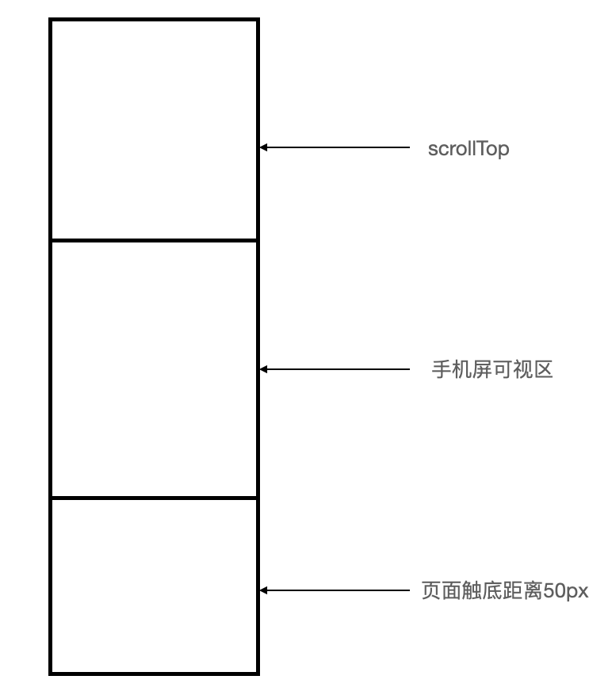

# WeChatProgramDev

------

### <u>Welcome to my project, here are some things I want to describe.</u>

微信开放平台与公众号平台概述

小程序与APP本质区别

小程序适合的业务场景

注册小程序开发者账号

使用小程序开发者工具创建小程序项目

### <u>Whether you are a native Chinese speaker or not, and want to learn Wechat applet development, try Google translation to master the above and next content.</u>

------

## 微信开发概述

### 1. 平台介绍

基于微信提供的大量接口和功能，进行二次开发，叫做**微信开发**。

- [微信开放平台](https://open.weixin.qq.com)（主要后端使用）

​	第三方网站调用微信登陆、支付、分享等微信开放的接口，需上微信开放平台申请相关的权限才可集成在自己的网站或者APP。同时需通过开发者资质认证，才可使用开放平台提供的能力。个人无法申请、仅企业可申请。

- [微信公众平台](https://mp.weixin.qq.com)（主要前端开发）

基于微信公众号为微信服务提供咨询并进行业务开发。

公众号包括订阅号（偏向为用户传达咨询）、服务号（偏向服务交互：银行、查询、114）、小程序（新的开放能力）、企业微信（企业专业办公管理工具：打卡、审批...）。

- 微信开放平台与公众平台的区别：

| 开放平台                               | 公众平台                                 |
| -------------------------------------- | ---------------------------------------- |
| 是微信对外开放API接口的平台            | 基于微信公众号，为微信用户提供服务的平台 |
| 开放的API接口，提供第三方网站和APP调用 | 所有公众号属于微信内开发                 |
| 后端程序员为开放平台的主力军           | 前端程序员为公众平台开发主力军           |

### 2. 初识小程序

- 小程序定义、特点、理念与目的：

链接用户与服务的媒介；体积小方便传播；轻度依赖；拦截用户流量入口，模拟APP体验

- 与传统手机APP区别：

在开发原理上，不同于手机系统提供的API而是通过微信提供的API。且小程序不同于APP运行于手机操作系统，而是基于手机微信。

------

## 小程序基础

### 1. 组件与 API

> #### 组件：
>
> 自带微信风格样式的组件是视图层基本单元。通常一个组件包括开始和结束标签，属性用来修饰这个组件，内容在两个标签之间。且所有<u>组件名称</u>和<u>属性名称</u>为小写。

> #### API：
>
> API（Application Programming Interface，应用程序编程接口）是预先定义的函数。通过API开发人员无需访问程序的源码。

### 2. API 分类及比较

| API类型  |                      特点                      |                             举例                             |
| :------: | :--------------------------------------------: | :----------------------------------------------------------: |
| 事件监听 |         以on开头，监听某个事件是否触发         | `wx.onNetworkStatusChange(function callback)` // 当网络状态改变 |
| 同步API  | 以```Sync```结尾、可以通过函数的返回值直接获取 | `var batteryInfo = wx.getBatteryInfoSync()` // 获取电池信息  |
| 异步API  |    需要指定回调函数接收调用的结果（大多数）    |       `wx.request(Object object)` // 发起HTTPS网络请求       |

**组件与API的异同点：**

组件以UI结构布局为主，一般不需处理业务逻辑。API以纯业务为主，一般没有对应UI结构。

组件与API都是官方提供，为方便小程序快速开发。

**练习：**

1. 下列不属于小程序的特点的是（A）

A、需要安装应用程序	B、体积小	C、方便获取	D、传播快

2. 下列不是小程序提供的API的是 （D）

A、`wx.onNetWorkStatusChange(fn,cb)`	B、`wx.getEatteryInfoSync()`	C、`wx.request(obj, obj)`	D、`wx.getElement()`

3. 使用微信开放平台需要具备什么（A）

A、开发者资质认证	B、微信资质认证	C、微信证书	D、微信内部职工

### 3. 开发账号

- [注册开发者账号](https://developers.weixin.qq.com/miniprogram/introduction/#%E5%B0%8F%E7%A8%8B%E5%BA%8F%E6%B3%A8%E5%86%8C)

- 基本信息设置：


登陆小程序后台->设置->基本设置

- 开发者设置：


小程序后台 -> 开发 -> 开发设置

- 成员权限说明：


开发者权限、运营者权限、数据分析者

### 4. 开发者工具的使用

- 下载微信开发者工具


- 小程序的`app.js`和`app.json`是必须的（小程序入口和全局配置文件必须的）


- 对于小程序的页面来说```.js和.wxml```文件是必须的（业务逻辑和UI结构）


------

## 小程序结构和组件

Vue组件与小程序页面、一般静态页面的对比：

| .vue组件         | 小程序页面  | 静态页面     |
| ---------------- | ----------- | ------------ |
| `template`模板   | `.wxml`结构 | `html` 结构  |
| `script`行为逻辑 | `.js`逻辑   | `.js` 逻辑   |
| `style`样式      | `.wxss`样式 | `.css` 样式  |
| `config` 配置    | `.json`配置 | `.json` 配置 |

`.wxml结构`：描述当前页面结构，提供类似于Vue中指令语法

`.js`：定义当前页面得到的数据、交互逻辑和形影用户的操作

`.json`：个性化配置

`.wxss`：定义样式美化**当前**页面，有类似 Vue 的 `<style scoped lang="less"> `效果

**练习：**

1. 下列属于小程序开发者权限是的（A）

A、开发模块权限	B、管理模块权限	C、统计模块权限	 D、推广模块权限

2. 在小程序项目中下列不属于管理员分配的权限是（A）

A、产品设计权限	B、开发者权限	C、运营者权限	D、数据分析者

3. 下列不属于小程序项目结构目录的是（C）

A、`app.js`	B、app.json	C、app.jsp	D、app.wxss

## 开始

### 创建项目页面：

pages 目录上右键 新建名为 home 目录，并在 home 目录中新建名为 home 的 page 页面，此时会自动生成相关文件

### 🖇设置默认首页：

`app.json` 全局配置文件找到 `pages` 节点。 `pages`节点是一个存储所有页面的访问路径的数组。其中 `pages` 数组中第一个路径页面就是小程序项目的默认首页。

### UI 组件：

**`text` 文本**

| 属性名       | 类型      | 默认值  | 说明                                                         |
| ------------ | --------- | ------- | ------------------------------------------------------------ |
| `selectable` | `Boolean` | `false` | `文本是否可选，除text外其他组件无法长按选中`                 |
| `space`      | `String`  | `false` | 显示连续空格，可选值：`ensp(每个空格渲染成英文长度)、emsp(每一个空格渲染成汉字的长度)、nbsp(每一个空格渲染成当前文字字体)` |
| `decode`     | `Boolean` | `false` | 是否解码，可解析 `&nbsp；&lt；&gt；&amp；&apos；&ensp；&emsp` |

**`Button` 按钮组件** <u>默认按钮独占一行,设置以后变为行内</u>

| 属性名     | 类型      | 默认值    | 说明                       |
| ---------- | --------- | --------- | -------------------------- |
| `size`     | `String`  | `default` | 按钮的大小                 |
| `type`     | `String`  | `default` | 按钮的样式类型             |
| `plain`    | `Boolean` | `false`   | 按钮是否为镂空，背景色透明 |
| `disabled` | `Boolean` | `false`   | 是否禁用                   |
| `loading`  | `Boolean` | `false`   | 名称前是否带有loading图标  |

**`input` 输入框**

| 属性名        | 类型      | 默认值  | 说明                               |
| :------------ | :-------- | :------ | :--------------------------------- |
| `value`       | `string`  |         | 输入框初始内容                     |
| `type`        | `string`  | `text`  | `input`类型                        |
| `placeholder` | `string`  |         | 输入框为空占位符                   |
| `password`    | `Boolean` | `false` | 是否密码类型                       |
| `disabled`    | `Boolean` | `false` | 是否禁用                           |
| `maxlength`   | `Number`  | 140     | 最大长度，设置为-1时不限制最大长度 |

**`image` 图片属性**

这里注意不是 `` 而是 `<image>`

`src`：支持网络图片或者本地图片	image图片默认宽高为w:300px、H:225px

`mode`：指定图片宽高和缩放的模式-`aspectFill(图片宽高完全拉伸填满image)`和`aspectFit(图片长边完全显示)`

**`view` 视图容器**

| 属性                   | 类型    | 默认值 | 必填 | 说明                                                         |
| :--------------------- | :------ | :----- | :--- | :----------------------------------------------------------- |
| hover-class            | string  | none   | 否   | 指定按下去的样式类。当 `hover-class="none"` 时，没有点击态效果 |
| hover-stop-propagation | boolean | false  | 否   | 指定是否阻止本节点的祖先节点出现点击态                       |
| hover-start-time       | number  | 50     | 否   | 按住后多久出现点击态，单位毫秒                               |
| hover-stay-time        | number  | 400    | 否   | 手指松开后点击态保留时间，单位毫秒                           |

### WXSS 样式：

是一套样式语言决定WXML组件显示的样式语言

相比于CSS扩展尺寸单位、样式导入的特性

支持绝大多数选择器，而有些许不同，如属性选择器需要加 `data-` 在属性之前

`rpx` 即 responsive pixel - 小程序独有解决屏幕自适应的单位（web端用的是rem需要手动换算）	- 不论什么屏幕都分为`750rpx`	

`rpx`与`px`之间的换算	-	以iphone6为标准例：`750rpx=375px(屏幕宽度)=750物理像素`	=>	<u>`1rpx=0.5px=1物理像素`</u>

`rpx`与`iPhone6`设计稿关系	-	**设计师视觉稿是二倍图**所以要绘制宽高`200px`盒子则可以直接换算为`200rpx`

### DEMO：

要求：使用`rpx`绘制一个占屏幕一半的盒子

思路：小程序的`rpx`尺寸单位把所有尺寸的屏幕同一划分了750分，不论屏幕大小，`375rpx`可以被小程序识别渲染为屏幕宽度的一半。

### 样式导入：

`@import` 导入外联样式表

```css
@import "wxss样式表的相对路径"
```

全局样式与局部样式

```js
全局样式定义在app.wxss中，作用于每一个页面中；局部样式在wxss文件中定义的样式，仅在对应页面，会覆盖app.wxss中相同选择器
当且仅当局部样式的权重大于或等于全局样式的权重时，才会覆盖全局样式的效果。
```

**练习：**

1. 在新建小程序页面默认生成的结构中不包含哪个后缀名的文件（B）

 A、`.js`	B、`.css`	C、`.json`	D、`.wxss`

2. 下列不属于text组件属性的是（D）

A、selected	B、space	C、decode	D、checked

3. 下列不属于button按钮属性的是（C）

A、size	B、type	C、plan	D、loading

### 全局配置文件：

`app.json` 配置文件主要配置节点：

| 配置节点   | 作用                                         |
| ---------- | -------------------------------------------- |
| pages数组  | 配置小程序的页面路径                         |
| window对象 | 设置小程序的状态栏、导航条、标题与窗口背景色 |
| tabBar     | 配置小程序的tab栏效果                        |

- `pages`：

指定小程序页面组成，每一项对应一个页面的 路径+文件名 信息

文件名不需要写文件后缀，框架会自动寻找对应位置的`.json`、`.js`、`.wxml`、`.wxss`四个文件进行处理

<u>建议自动创建新页面的方式</u>：在app.json => pages数组节点 => 新增页面路径并保存 =>自动创建路径对应页面

设置默认首页：数组第一项代表小程序的初始页面、小程序中新增或删除页面都必须对 pages 数组进行修改

------

小程序窗口的组成部分

| 组成            | 说明                         |
| --------------- | ---------------------------- |
| `navigationBar` | 导航条区域                   |
| `background`    | 背景区域，默认不见，下拉可见 |
| `page`          | 页面主体区域，显示wxml中布局 |

- window节点常用的配置项


| 属性名                         | 类型       | 默认值    | 说明                                     |
| ------------------------------ | ---------- | --------- | ---------------------------------------- |
| `navigationBarTitleText`       | `Sring`    | 字符串    | 导航栏标题文字类容                       |
| `navigationBarbackgroundColor` | `HexColor` | #`000000` | 导航栏背景颜色，如#`000000`              |
| `navigationBarTextStyle`       | `Sring`    | `white`   | 导航栏标题颜色、支持`black\white`        |
| `backgroundColor`              | `HexColor` | `#ffffff` | 窗口的背景色                             |
| `backgroundTextStyle`          | `Sring`    | `dark`    | 下拉loading的状态，仅支持derk、light     |
| `enablePullDownRefresh`        | `Boolean`  | `false`   | 是都开启全局下拉刷新                     |
| `onReachBottomDistance`        | `Number`   | 50        | 页面上拉触底事件触发距离底部距离，单位px |

- tabBar-配置Tab栏


应用端常见页面效果，用于实现多页面的快速切换；小程序分底部 tabBar 和顶部 tabBar。

tabBar中，只能配置最少2个最多5个tab页签，页面渲染顶部tabBar时，不现实icon，只显示文本。

| 组成               | 说明                      |
| ------------------ | ------------------------- |
| `backgroundColor`  | 导航条背景色              |
| `selectedIconPath` | 选中时的图片路径          |
| `boderstyle`       | tabBar上边框的颜色        |
| `iconPath`         | 未选中时图片路径          |
| `selectedColor`    | tab上文字选中的颜色       |
| `color`            | tab上未选中的文字默认颜色 |

tabBar节点的list的配置项

| 属性               | 类型     | 必填 | 描述                                                      |
| ------------------ | -------- | ---- | --------------------------------------------------------- |
| `pagePath`         | `String` | 是   | 页面路径，必须在pages中先定义                             |
| `text`             | `String` | 是   | tab上按钮文字                                             |
| `iconPath`         | `String` | 否   | 图片路径不支持网络图（建议大小限制40kb，尺寸为81px*81px） |
| `selectedIconPath` | `String` | 否   | 选中时的图片路径                                          |

页面级别配置文件与全局级别配置文件

小程序`app.json`中的`window`节点，可以 全局配置 小程序中每个页面的窗口表现。若特殊页面窗口表现则配置页面级别的json。

总结：页面级别配置优先于全局配置生效。

页面配置文件中可选的配置项列表

| 属性                           | 类型       | 默认值    | 描述                                 |
| ------------------------------ | ---------- | --------- | ------------------------------------ |
| `navigationBarBackgroundColor` | `HexColor` | `#000000` | 导航栏背景颜色                       |
| `navigationBarTextStyle`       | `String`   | `white`   | 导航栏标题颜色                       |
| `navigationBarTitleText`       | `String`   |           | 导航栏标题文字内容                   |
| `backgroundColor`              | `HexColor` | `#ffffff` | 窗口背景色                           |
| `backgroundTextStyle`          | `String`   | dark      | 下拉loading的样式，仅支持dark、light |

下列不属于小程序项目中app.json文件配置节点的是（D）

A、pages数组	B、windows对象	C、tabBar对象	D、navBar对象

在小程序项目中开启全局下拉刷新的属性是（C）

A、navigationBarTitleText	B、navigationBarBackgrondColor	C、enablePullDownRefresh	D、navigationBarTextStyle

在小程序项目中可以设置导航栏标题文本颜色的属性是（D）

A、navigationBarTitleText	B、navigationBarBackgrondColor	C、navigationBarText	D、navigationBarTextStyle

------

### 生命周期（Life Cycle）

生命周期指一个对象从 创建=>运行=>销毁 的整个过程，强调的是一个时间段。

小程序生命周期：应用生命周期（启动、运行、销毁）、页面生命周期（页面加载、渲染、销毁）。应用生命周期包括多个页面生命周期。

生命周期函数：框架提供的内置函数，会 **自动按次序执行** 某些特定操作。

生命周期强调时间段，生命周期函数强调时间点。

`app.js`是小程序执行入口，在其中必调用`App()`，其中参数有`onLaunch:`、`onShow:`、`onHide:`

小程序页面必须调用自己的 `.js` 文件，同时也必须有调用`Page()函数`：**onLoad、onShow、onReady、onHide、onUnload** 否则报错。

在应用周期app函数中不属于生命周期函数的是（B）

A、onLaunch：function(){}	 B、oncheck:function(){}	C、onShow:function(){}	 D、onHide:function(){}

在小程序项目中小程序被最小化后可以执行哪个函数：（D）

A、onLaunch：function(){}	B、oncheck:function(){}	C、onShow:function(){}	D、onHide:function(){}

在小程序中页面生命周期函数必须调用哪个函数才可以（D）

A、`wx()`	B、`App()`	C、`wxApp()`	D、`Page()`

------

### 数据绑定与应用绑定

小程序的 `.js` 部分文件可以定义页面的数据、生命周期、其他业务

在 `.js` 文件中，数据定义在 data 节点下

```js
Page({
  data: {
    info: "init data", // 字符串类型数据
    array: [{msg: '1'}, {msg: '2'}] // 数组类型的数据
  }
})
```

数据绑定使用Mustache语法格式：绑定数据、绑定属性以及进行三元运算。

```html
<view>{{要绑定的数据名称}}</view>
```

事件绑定：

事件是视图层与逻辑层的通讯

bindtap 绑定触摸事件-不同于网页的 onclick 鼠标点击事件，而是通过 tap 事件响应触摸行为。

```
<view bindtap="tapName">Click me!</view>
```

```
Page中定义:
Page({tapName:function(event){console.log(event)}})
```

bindinput 绑定文本框的输入事件

```
<input bindinput="inputName"></input>
```

```
Page({inputName:function(event){event}})
```

data和文本框之间数据同步：

1.监听文本框的数据变化```event.detail.value```、2.修改 data 中的数据```this.setData(dataObject)```

事件传参：

不能在绑定事件的同时传递参数 => 小程序会把bindtap后的值统一当做事件名称来处理-如下述代码报错：

```html
<!--btnHandler(123)都看作事件名称-->
<button type="primary" bindtap='btnHandler(123)'>事件传参</button>
```

只能通过 ```data-*```自定义事件属性传参：

如果要在组件触发事件处理函数时，传递参数，可以为组件提供 ```data-*```自定义属性传参，并使用```event.target.dataset```参数名获取自定义属性传递到事件处理函数中的参数。

```html
<button bindtap="btnHandler" data-info="zairesinatra">事件传参</button>
info视作参数名、数值zairesinatra当做参数值
```

`wxs(WeiXin Script)`脚本：

wxs 是小程序一套脚本语言，结合`WXML`可以构建页面的结构

```
1.没有兼容性，不依赖运行时的基础库版本，可以在所有版本的小程序中运行 2.与javascript不同 3.隔离性：不能调用js文件定义的函数以及小程序提供的API 4.不能进行事件回调 5.ios设备上必javascript快-(某些功能能写wxs就写wxs,因为效率高)
```

`wxs(WeiXin Script)`遵循`CommonJS`模块化规范：

`CommonJS`是`Javascript`模块化规范之一，故使用`wxs`和`node.js`体验类似，可以使用CommonJS规范规定的如下成员：

```
module对象：每个wxs都是 独立的模块，每个模块有一个内置的module对象与作用域。
module.exports：由于wxs独立的作用域，所以在一个模块里定义的变量与函数，默认为私有，对其他模块不可见。
require()函数：在wxs模块中引用其他的wxs文件，可以使用require函数
```

`wxs基础语法`

```js
使用module.exports向外共享私有变量
var foo = "'hello world'from wxs"	//定义私有化变量
var bar = function(e){return e;}
module.exports = {FOO:foo,bar:bar,}
module.exports.msg = "some msg" // 额外向 module.exports 挂载 msg 变量
```

```
使用require注意点
1.只能使用.wxs文件模块，且必须相对路径
2.wxs模块均为单例，即都是引用的同一 wxs 模块对象
3.如果一个wxs模块在定义后一直没有被引用则改模块不会被解析与运行
```

[wxs`支持的数据类型`](https://developers.weixin.qq.com/miniprogram/dev/reference/wxs/06datatype.html)：

| 数据类型   | 数据类型 | 数据类型  | 数据类型 |
| ---------- | -------- | --------- | -------- |
| `number`   | `string` | `boolean` | `objecr` |
| `function` | `array`  | `date`    | `regexp` |

`内嵌wxs脚本`

`wxs`可以编写在`wxs文件`<wxs></wxs>标签内，但是必须提供一个 module 属性，指定当前标签的模块名

`wxs`可以编写在内联作用：

```js
<view>{{foo.msg}}</view>
<!-- 内嵌wxs -->
<wxs module="foo">
  var some_msg = 'Hello world'
  module.exports = {
    msg:some_msg
  }
</wxs>
```

`wxs`可以编写在外联作用：

`wxs` 代码可以编写在以 `.wxs` 为后缀名的文件内，就像 JavaScript 代码可以编写在以 `.js` 后缀名的文件一样。如果要引入外联的 wxs 脚本，则必须为 `<wxs></wxs>` 标签添加 module 和 src 属性。其中 `module` 为标签指定模块名，作为当前页面访问这个模块的表示名称；`src` 指定当前的引入脚本路径，且必须是相对路径。

```js
var foo = 'hello world from tools.wxs'
var bar = function(zs){
  return zs
}
module.exports = {
  FOO:foo,
  bar:bar
}
module.exports.msg = 'some message'
```

```html
<!-- 外联wxs -->
<wxs src="./../tools.wxs" module="tools"></wxs>
<view>{{tools.msg}}</view>
<view>{{tools.bar(tools.FOO)}}</view>
//别用太高级的JS const、let
```

这里注意不要在 `.wxs` 想当然直接使用 `.js` 的 `let、const` 等语法，只能使用 `var` ；在 node.js 中向外暴露的变量与名一样可以简写，而 `wxs` 中不能简写。

------

### 页面渲染

#### 条件渲染：

1.小程序中使用`wx:if="{{condition}}"`来判断是否需要渲染该代码，同时也可使用`wx:elif`和`wx:else`来添加一个`else`块。

```html
<view wx:if="{{condition}}">True</view>
//example
<view wx:if="{{length>6}}">666</view>
<view wx:elif="{{length>3}}">333</view>
<view wx:else>emememe</view>
```

2.`block wx:if`可一次性判断多个组件标签，通过`<block></block>`标签将多个组件包装起来，并上边使用`wx:if`控制属性

```html
<block wx:if="{{true}}"><view>view1</view><view>view2</view></block>	
// view1 view2都会显示	block为包装元素，不会在页面中做任何渲染
```

3.`hidden`也可以控制小程序的显示与隐藏

```html
<!--hidden="{{condition}}"-->
<view hidden="{{true}}">略略略</view>
```

4.`wx:if `与`hidden`区别：

- 被`wx:if`控制的区域会进行局部渲染，动态创建或销毁


- 同时`wx:if`是惰性的，在条件第一次为真才会开始局部渲染


- 相比之下`hidden`简单，组件始终渲染，知识简单控制显示与隐藏


- `wx:if`会有更多的切换消耗，`hidden`会有更多的初始渲染消耗

#### 列表渲染：

1.`wx:for`	组件上使用`wx:for`控制属性绑定一个数组，即可使数组中各项的数据重复渲染该组件。默认当前数组当前项下标变量名为`index`，数组当前变量名为`item`。

```html
<view wx:key="index" wx:for="{{array}}"> 索引是{{index}} 当前项是{{item}} </view>
```

2.手动指定索引和当前项的变量名

```html
<!--wx:for-item指定当前数组元素变量名	wx:for-index指定数组当前下标的变量名-->
<view wx:for="{{array}}" wx:for-index="idx" wx:for-item="itemName">索引是{{idx}} 当前项是{{itemName}}</view>
```

3.列表渲染中的`key`

```key```在列表循环中的作用即如果**列表中项目的位置会动态改变**或者**有新的项目添加到列表中**，且**希望列表中的项目保持字节的特征和状态**，需要使用```wx:key```来指定列表中项目的唯一的标识符。当数据改变触发渲染层重新渲染时，会矫正带有key的组件，框架会确保他们被重新排序而不是重新创建，以确保是组件保持自身的状态，提升渲染的效率与性能并避免数据混乱的情况出现。

key不绑定index,因为每次渲染索引值重新排号。

`key`值具有唯一性且不能动态改变、`key`值必须是数字或字符串、保留关键字`*this`代表在`for`循环中`item`本身，也可充当`key`值，但需要`item`本身是有一个唯一的字符串或者数字、如果不提供`wx:key`会在终端报一个`warning`，若明确知道列表是静态的，或者不关注其顺序则可以选择忽略。

页面事件：

1.下拉刷新	用户手指在屏幕上自上而下滑动，从而移动端更新列表数据的交互行为。相比定时以及按钮刷新有更好的用户体验。

2.启动下拉刷新：·需要在```app.json```的```window```选项中或页面配置开启```enablePullDownRefresh```。一般情况推荐在页面配置中为需要的页面单独开启下拉刷新。·或调用顶级对象的函数```wx.startPullDownRefresh()```触发下拉刷新

3.配置下拉刷新窗口的样式：在app.json文件的window选项中修改```backgroundColor```或```backgroundTextStyle```选项

4.监听下拉刷新事件：给页面添加```onPullDownRefresh()```函数即可监听在当前页面下拉刷新操作

5.停止下拉刷新效果：下拉刷新效果不会主动消失，应手动调用```wx.stopPullDownRefresh()```

6.上拉加载更多的概念及应用场景：本质是数据的分页加载

7.配置上拉触底的距离：在```app.json```的```window```选项中或页面配置中设置触底距离```onReachBottomDistance```。单位是```px```默认触底距离为```50px```。而当上拉超过不足```50px```时会触发```onReachBottom()```函数。监听用户当前页面上拉触底事件，实现上拉加载更多列表的效果。



其他页面事件：

1.```onPageScroll(Object)```监听滑动页面事件，其中的```Object```参数说明如下

| 属性            | 类型   | 说明                       |
| --------------- | ------ | -------------------------- |
| ```scrollTop``` | Number | 页面在垂直方向已滚动的距离 |

2.```onShareAppMessage(Object)```监听用户点击页面内转发按钮```<button>组件:open-type="share"```或与上角菜单"转发"按钮行为，并自定义转发内容。其中```Object```参数说明如下。

| 参数             | 类型         | 说明                                                         |
| ---------------- | ------------ | ------------------------------------------------------------ |
| ```from```       | ```String``` | 转发事件来源，button来自页面内转发按钮，menu来自右上角转发菜单 |
| ```target```     | ```Object``` | 若from值为button，则```target```触发这次转发事件的```button```，否则为```undefined``` |
| ```webViewUrl``` | ```String``` | 页面包含<web-view>组件时，返回当前<web-view>的```url```      |

转发期间自定义转发的内容-```onShareAppMessage(Object)```retuen一个自定义转发内容。

| 字段           | 说明           | 默认值         |
| -------------- | -------------- | -------------- |
| ```title```    | 转发标题       | 当前小程序名称 |
| ```path```     | 转发路径       | 当前页面path   |
| ```imageUrl``` | 自定义图片路径 | 使用默认截图   |

3.```onTabItemTap(Object)```-底部Tab栏触发

| 参数           | 默认值       | 说明                       |
| -------------- | ------------ | -------------------------- |
| ```index```    | ```String``` | 被点击tabItem序号，从0开始 |
| ```pagePath``` | ```String``` | 被点击tabItem页面路径      |
| ```text```     | ```String``` | 被点击tabItem的按钮文字    |

